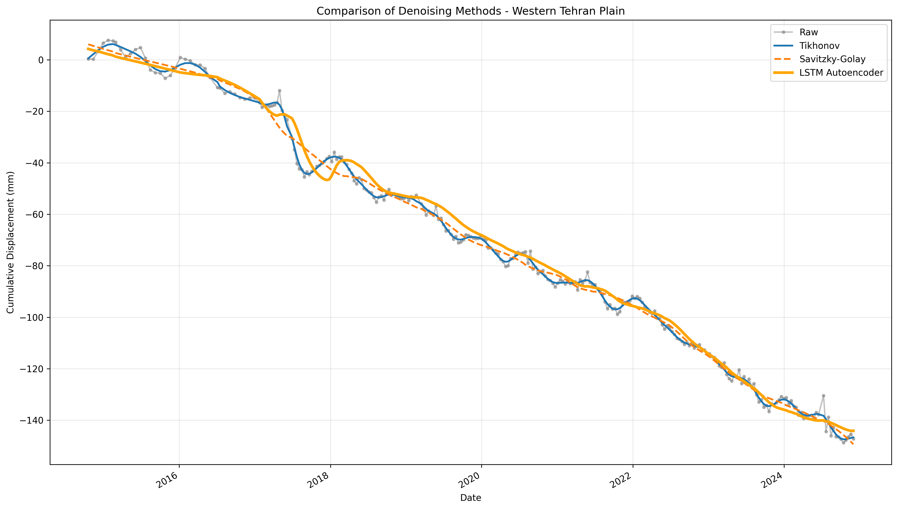
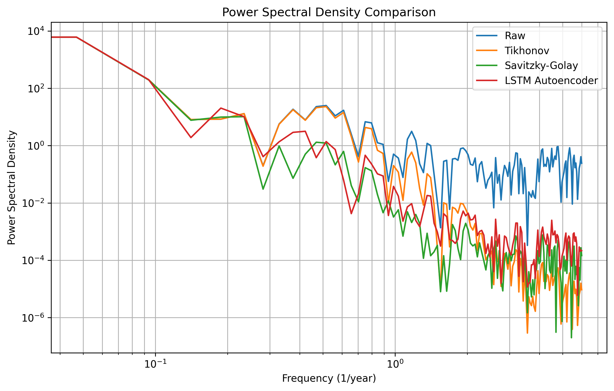

# Geo-Deformation-Lab 🛰️

**Denoising InSAR Time Series Using Tikhonov Regularization and LSTM Autoencoder**  
**Application to Subsidence Monitoring in Western Tehran Plain**

[](https://www.python.org)
[](https://opensource.org/licenses/MIT)
[](https://github.com)

## Overview

This repository implements denoising methods for InSAR time series data, inspired by the paper:

> Safari, A., Sharifi, M.A., Bagheri, H., Allatavakoli, Y. (2013).  
> *Time-variable gravity determination from the GRACE gravity solutions filtered by Tikhonov regularization in Sobolev subspace.*  
> Journal of Earth and Space Physics, 39(2), 51-77.

The original paper applies generalized Tikhonov regularization to filter noise in GRACE gravity data. This project adapts the Tikhonov method to InSAR time series and compares it with:
- Savitzky-Golay filter
- LSTM Autoencoder (deep learning approach)

The goal is to remove atmospheric and decorrelation noise while preserving physical subsidence signals in the Western Tehran Plain (a region with severe groundwater-induced subsidence).

Results show that the **LSTM Autoencoder** provides adaptive denoising without manual parameter tuning, achieving performance comparable to or better than traditional methods.

## Key Results

### Comparison of Denoising Methods


### Power Spectral Density (PSD) Analysis


### Quantitative Metrics (Single Pixel)

| Method            | STD (mm) | Variance Reduction (%) | Subsidence Rate (mm/yr) |
|-------------------|----------|-------------------------|--------------------------|
| Raw               | ~5.4     | 0                       | ~17–18                   |
| Tikhonov (α=10)   | ~5.1     | ~11                     | ~17–18                   |
| Savitzky-Golay    | ~4.3     | ~37                     | ~17–18                   |
| LSTM Autoencoder  | ~4.4     | ~33                     | ~17–18                   |

> The LSTM Autoencoder achieves excellent high-frequency noise suppression (as seen in PSD) and preserves non-linear deformation events more naturally than traditional filters.

## Project Structure

Geo-Deformation-Lab/
├── Data/
│   └── 000002_028A_05385_191813_filt.hdf5
├── analysis/
│   ├── tikhonov_1d.py
│   ├── savitzky_golay.py
│   ├── lstm_autoencoder.py
│   └── metrics.py
├── figures/                  # Generated plots
├── read_data.py
├── main_comparison.py        # Run full comparison
├── demo_lstm.py              # Demo: only LSTM plot
└── README.md

## Requirements

```bash
pip install numpy matplotlib scipy pandas h5py torch
```

## How to Run

1. Full comparison (table + PSD + all methods):
```python main_comparison.py```

2. Only LSTM denoising:
```python demo_lstm.py```

3. Only Savitzky_golay:
```python demo_savitzky.py```

## Future Work

Integration with GRACE-FO data for mass balance analysis
Application to full regional grid
Testing advanced models (CNN, Transformer)

## Acknowledgments
- This work is inspired by and builds upon the research of Dr. Abdolreza Safari on gravity field denoising using Tikhonov regularization.

- **Author**: Farzin Ahmadzade

- **University of Tehran - Faculty of Engineering**